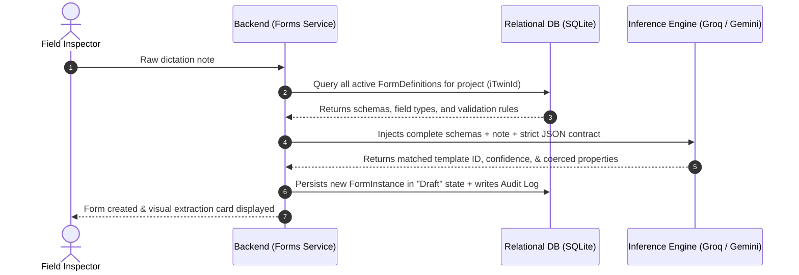
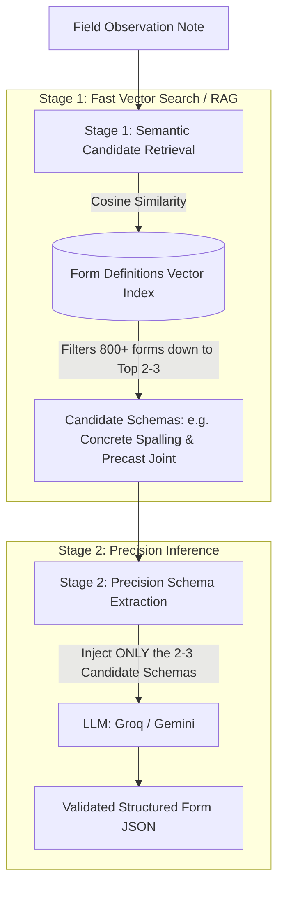

# Bentley Systems — AI-Enabled Infrastructure Forms & Workflow Service

> **Next-Generation Autonomous Field-to-Office Inspection & Governance Service for Bentley Cloud Platform (iTwin & SYNCHRO)**

[](https://github.com/hychenengineer/bentley-system-demo/releases/latest)
[](https://github.com/hychenengineer/bentley-system-demo/releases/download/v1.0.0/bentley-system-demo-win-x64.zip)

📦 **[Download Standalone Windows App (.zip)](https://github.com/hychenengineer/bentley-system-demo/releases/download/v1.0.0/bentley-system-demo-win-x64.zip)** — *No .NET installation required. Extract and double-click `Start-Demo.bat` to launch on http://localhost:5088.*

> [!IMPORTANT]
> **🔑 API Key Requirement & Offline Fallback Mode:**
> You need an API key from either **[Groq](https://console.groq.com)** (ultra-fast, free tier available) or **[Google AI Studio](https://aistudio.google.com)** (Gemini) in order to use the full LLM extraction and safety triage capabilities.
> 
> **Testing without an API Key?** Open the **⚙️ Settings** modal in the UI and turn on **"Enable Fallback to Heuristic Engine"**. This allows the system to extract and auto-create structured forms offline using the built-in deterministic civil domain heuristic engine without requiring any external LLM credentials!

An intelligent, cloud-native form management and workflow execution service built to bridge the gap between **unstructured site reality** (noisy field voice dictations, mobile notes) and **rigid engineering data structures & regulatory state machines** (Bentley iTwin, SYNCHRO Field, and SYNCHRO Control).

---

## 🏗️ What This System Is For

In civil infrastructure mega-projects (highways, tunnels, rail, bridges), field inspectors encounter fast-moving, hazardous site conditions. Documenting inspections manually on clipboards or navigating complex 30-field dropdowns on mobile devices causes delayed reporting, missing safety data, and regulatory non-compliance.

This service implements a **Dual-Persona Architecture**:

1. **Field Inspector (SYNCHRO Field)**:
   - **Live Voice Dictation**: Directly dictate field observations using in-browser speech recognition.
   - **Zero-Form AI Extraction**: The engineer speaks naturally (e.g., *"Pier 4 East Footing: Found severe honeycomb spalling, roughly 5.5 inches deep, with exposed rusting rebar and active moisture seepage. Halted concrete pour on Bay 2 immediately."*).
   - **Automated Schema Matching**: The system classifies the observation, matches it to the correct project form template, coerces numbers and booleans into strict data types, and instantiates a validated Draft Form.

2. **Office Lead & Safety Officer (SYNCHRO Control)**:
   - **Autonomous AI Triage**: Evaluates submitted forms against infrastructure safety standards (e.g., OSHA 1926 Subpart P excavation rules).
   - **Deterministic State Machine**: Governs legal status transitions (`Draft` → `Submitted` → `SafetyHalt` → `UnderSafetyReview` → `Resolved` → `Closed`).
   - **Regulatory Provenance & Audit Trail**: Every AI action, model identifier, confidence score, and state transition is cryptographically logged for forensic and contractual accountability.

---

## ⚡ Key Features

- **🎙️ Live In-Browser Voice Dictation**: Speech-to-text recording with real-time transcription.
- **🛡️ Strict Out-of-Domain Guardrails**: Rejects irrelevant chatter (e.g. food, weather, office IT) with `matchedDefId = "NONE"` and explanations.
- **⚡ Ultra-Fast Multi-Provider LLMs**: Supports **Groq** (Llama 3.3 70B, GPT-OSS 120B/20B, Qwen 2.5 27B) at 300+ tokens/sec, and **Google Gemini** (Gemini 2.5 Flash, 3.1 Flash Lite).
- **⚙️ Secure Client-Side Key Management**: Bring your own API keys via the UI Settings modal; keys are stored exclusively in the browser's `localStorage` (zero secret leakage on the server).
- **🔒 Tamper-Proof State Governance**: Forms submitted to the engineering office are automatically locked against field tampering.
- **📜 Complete OpenAPI / Swagger**: Interactive API exploration available at `/swagger`.

---

## 🧠 AI Architecture Deep Dive

### 1. Current Implementation: Single-Stage Dynamic Schema Injection

In this demo, the service uses **Single-Stage Dynamic Schema Injection**:



#### How it works:
1. **Dynamic Schema Retrieval**: When an observation is received, the backend queries SQLite for all active `FormDefinitions` registered under the project (`iTwinId`).
2. **Context Augmentation**: Form definitions, required fields, data types (`number`, `boolean`, `select`), and enum options are dynamically formatted into JSON and injected into the prompt.
3. **Single-Pass Inference**: The LLM simultaneously acts as:
   - A **classifier** (selecting the correct template ID).
   - An **extractor** (mapping spoken text to typed schema keys).
   - A **guardrail** (rejecting non-civil engineering input).
4. **Audit Logging**: The model ID and confidence score are permanently recorded into the form's regulatory audit trail.

---

### 2. Scaling to Enterprise: Two-Stage Hierarchical RAG Architecture

While Single-Stage Injection is fast and simple for projects with 2 to 30 form types, enterprise infrastructure programs often maintain **hundreds or thousands of specialized templates** (concrete, electrical switchgear, tunnel boring, environmental, MEP).

Dumping 800+ full schemas into a single prompt creates major challenges:
- **Token Bloat & Cost**: 800 forms $\approx$ 120,000 tokens per request.
- **Latency**: Multi-second response times on mobile devices.
- **"Lost-in-the-Middle" Attention Degradation**: LLMs struggle with precision when choosing between hundreds of overlapping schemas in a massive context window.

#### The Two-Stage Solution:



#### Step-by-Step Breakdown:
1. **Stage 1 (Vector Candidate Retrieval / RAG)**:
   - Each form definition's metadata (`DisplayName` + `Description` + `Discipline Keywords`) is embedded in a vector database (e.g. SQLite-vec, pgvector, or Pinecone).
   - A fast vector similarity lookup against the inspector's note discards irrelevant forms (e.g. Electrical, HVAC) and returns only the **Top 2 to 3 most relevant candidate templates** in ~15ms.
2. **Stage 2 (Precision Extraction)**:
   - The backend queries the database for the detailed schemas of **only those 2–3 candidates**.
   - The LLM receives a compact, focused prompt (~800 tokens instead of 120,000 tokens).
   - Achieves near-100% field precision with sub-second response times and 99% cost reduction.

#### Architecture Comparison:

| Metric | One-Stage (Current Demo) | Two-Stage (Enterprise RAG) |
| :--- | :--- | :--- |
| **Supported Templates** | 2 – 30 form types | 1,000+ form types |
| **External Dependencies** | Zero (Embedded SQLite) | Vector Index (SQLite-vec / pgvector) |
| **Prompt Size** | ~1,500 – 3,000 tokens | **~800 tokens (Constant)** |
| **Inference Latency** | ~400ms – 1.2s | **~400ms (Even with 10,000 forms)** |
| **Best Used For** | Fast demos, focused projects | Enterprise multi-discipline programs |

---

## 🛠️ Technology Stack

- **Backend**: C# / .NET 8 Web API
- **Persistence**: Entity Framework Core with SQLite (Auto-migrated & seeded)
- **AI Providers**: Groq Cloud API (OpenAI-compatible) & Google Gemini REST API
- **Frontend**: Vanilla JavaScript (ES6+), Semantic HTML5, CSS3 Variables (Zero-dependency, high performance)
- **API Specification**: OpenAPI / Swagger v2

---

## 🚀 Getting Started

### Prerequisites
- [.NET 8.0 SDK](https://dotnet.microsoft.com/download/dotnet/8.0)
- A modern web browser (Google Chrome or Microsoft Edge recommended for voice dictation support)
- *(Optional)* A free [Groq API Key](https://console.groq.com) or [Google AI Studio Key](https://aistudio.google.com)

### Installation & Running Locally

1. **Clone the repository**:
   ```bash
   git clone https://github.com/YOUR_USERNAME/bentley-system-demo.git
   cd bentley-system-demo
   ```

2. **Run the service**:
   ```bash
   cd BentleyFormsService
   dotnet run --urls "http://localhost:5088"
   ```

3. **Open the Web Application**:
   Navigate to:
   ```text
   http://localhost:5088
   ```

4. **Configure your AI Settings**:
   - Click the **⚙️ Settings** button in the top-right header.
   - Enter your Groq API key (`gsk_...`) or Google Gemini key (`AIza...`).
   - Select your preferred model (e.g. `openai/gpt-oss-120b` or `gemini-2.5-flash`).
   - Click **Save Settings** (keys are saved safely in your browser's local storage).

5. **Try the Demo**:
   - **Field Mode**: Click the microphone icon 🎤 to dictate an observation, or click one of the quick scenario chips (e.g. *Pier 4 Concrete Spalling* or *Zone B Deep Trench Hazard*).
   - Click **Extract Fields & Create Draft Form**.
   - **Office Mode**: Switch to the **Office Admin & Lead** tab to inspect the form, click **⚡ Run AI Triage**, review the safety recommendation, and click **✓ Apply Recommended Escalation** to transition the state machine!
